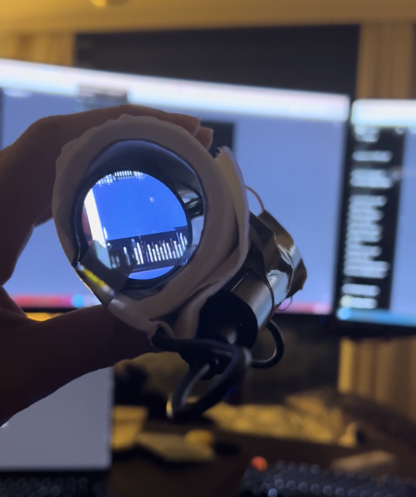

# paperroll-nightvision

휴지심 안에 넣은 야간투시경입니다. 카메라로 들어온 영상을 원형 LCD에 그대로 띄워, 어두운 곳을 눈으로 보듯 확인합니다.



## 왜 휴지심인가

야간투시경은 한쪽 눈에 대고 보는 물건입니다. 눈에 대는 통이 있어야 하고, 그 통은 화면 크기에 맞아야 하고, 주변 빛이 새어 들어오면 안 됩니다.

휴지심이 마침 그 조건을 다 만족합니다. 지름이 원형 LCD와 비슷하고, 속이 비어 있고, 얼굴에 대기 편한 길이입니다. 케이스를 따로 설계해 출력할 것 없이 바로 만들어볼 수 있었습니다.

## 하드웨어 구성

- **라즈베리파이 제로** — 카메라 영상을 받아 화면으로 넘기는 제어 보드입니다.
- **라즈베리파이 번들 카메라 모듈** — 특별한 부품이 아니라 기본으로 딸려오는 카메라 모듈입니다. 대신 렌즈 안쪽의 적외선 차단 필터를 제거했습니다. 원래 이 필터는 사람 눈에 보이지 않는 적외선을 걸러내 사진 색을 자연스럽게 만드는 부품인데, 이걸 떼어내면 카메라가 적외선까지 받아들여 어두운 곳에서도 형체를 잡아냅니다. 야간투시가 되는 이유가 여기에 있습니다.
- **GC9A01 원형 LCD** — 눈에 대고 보는 화면입니다. 240x240 원형이라 스코프처럼 보입니다. 구동에는 [gc9a01-overlay](https://github.com/sprtms400/gc9a01-overlay) 드라이버를 사용했습니다.
- **휴지심** — 위 부품들을 담는 몸체입니다.

카메라와 LCD를 라즈베리파이 제로에 연결하고, 휴지심 안쪽에 넣어 고정한 구조입니다.

## 동작 방식

```
카메라 모듈 (IR 차단 필터 제거)
  → 라즈베리파이 제로가 프레임을 읽음
  → GC9A01 원형 LCD 로 출력
  → 휴지심 반대편에서 눈으로 확인
```

중간에 저장하거나 가공하는 단계 없이, 들어온 영상을 곧바로 화면에 흘려보냅니다. 지연을 줄이는 것이 목적이라 그렇습니다.
